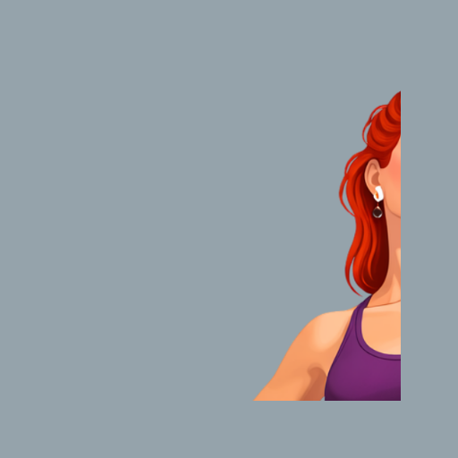
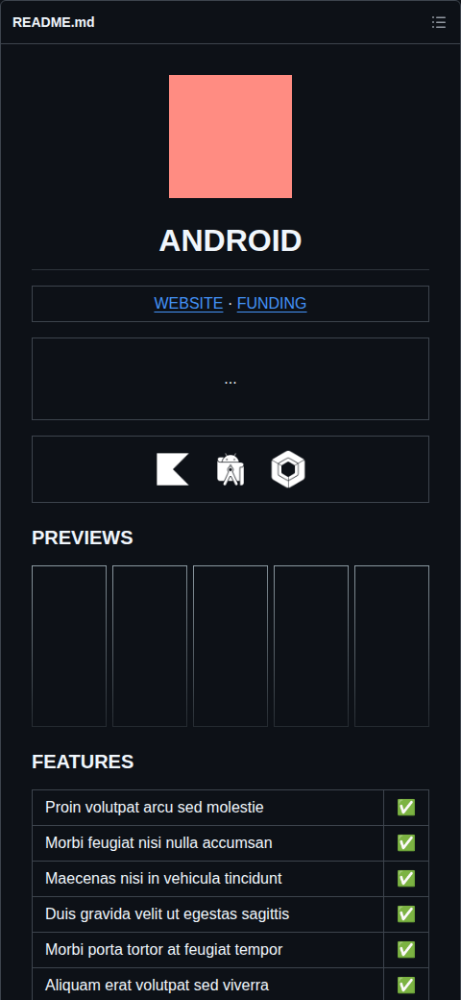
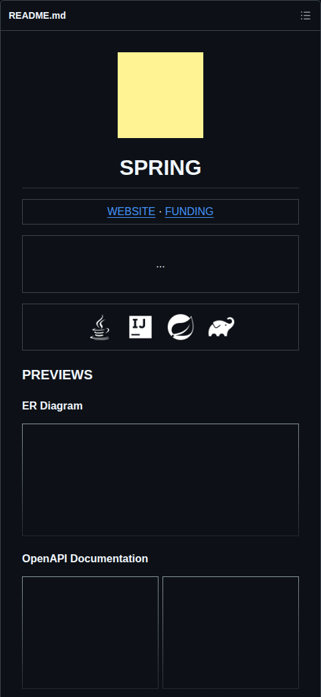
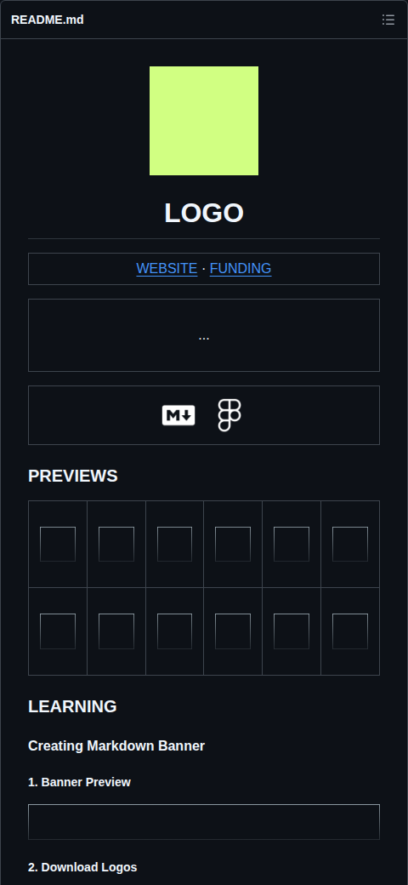
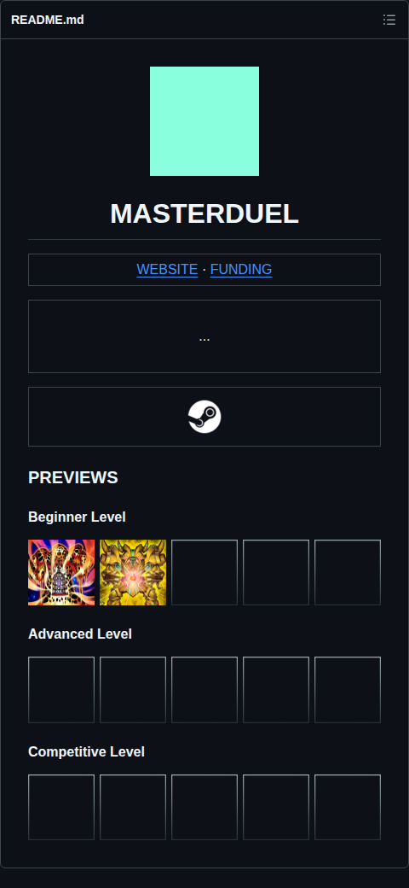
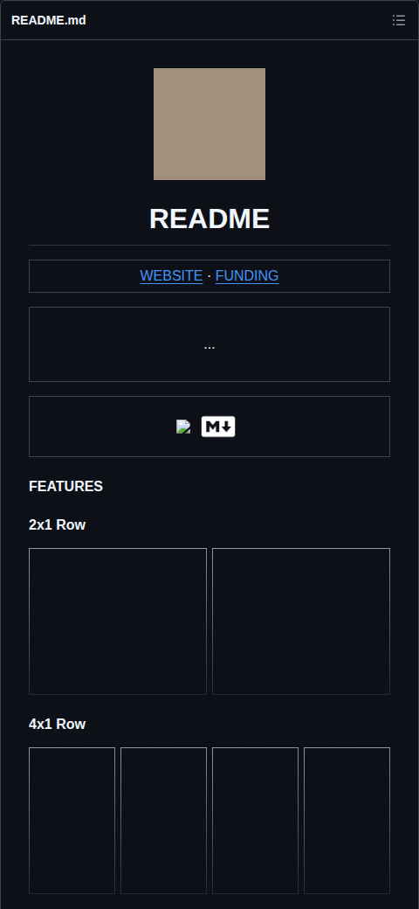
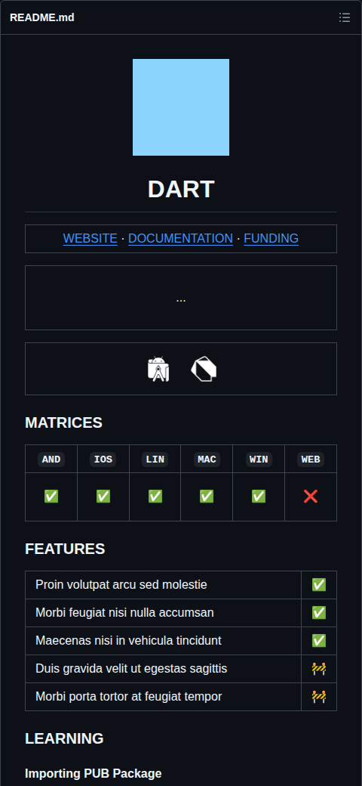
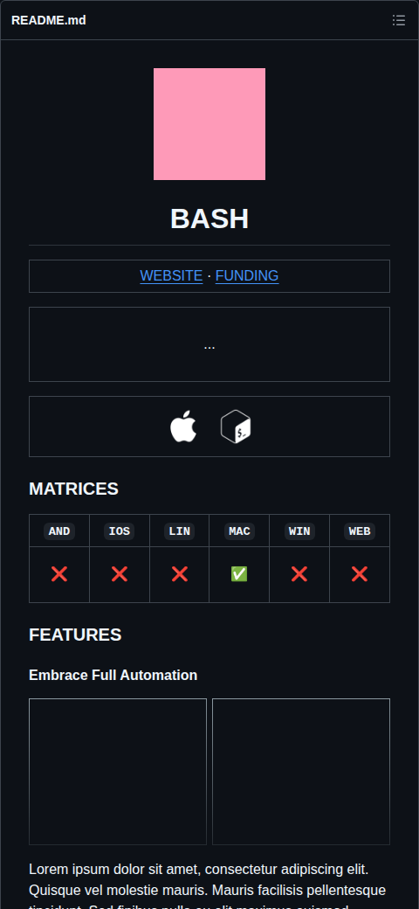
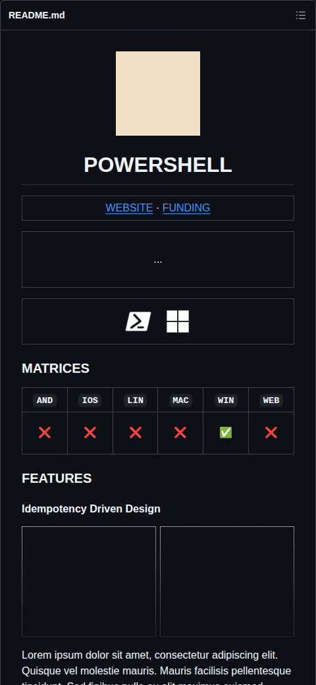

<div align="center">
  <p></p>
  <h1>READBASE</h1>
</div>

<table><tr><td align="center" width="9999"><p>
  <a href="https://olankens.com">WEBSITE</a> ·
  <a href="https://ko-fi.com/olankens">FUNDING</a>
</p></td></tr></table>

<table><tr><td align="center" width="9999">&nbsp;<p>
  README preset collection optimized for the vast majority of very commonly used Markdown renderers, including all those from GitHub, GitLab, PyPI, NPM, Crates, and many other similar very popular systems.
</p>&nbsp;</td></tr></table>

<table align="center"><tr><td align="center" width="9999"><p>
  <!-- LOGO_START -->
  <picture><source media="(prefers-color-scheme: dark)" srcset="assets/logos/apple-dark.png"></picture>
  <picture><source media="(prefers-color-scheme: dark)" srcset="assets/logos/gradle-dark.png"></picture>
  <picture><source media="(prefers-color-scheme: dark)" srcset="assets/logos/powershell-dark.png"></picture>
  <picture><source media="(prefers-color-scheme: dark)" srcset="assets/logos/androidstudio-dark.png"></picture>
  <picture><source media="(prefers-color-scheme: dark)" srcset="assets/logos/steam-dark.png"></picture>
  <!-- LOGOS_CEASE -->
</p></td></tr></table>

### PREVIEWS

#### Presets

<!-- PRESETS_START -->
<p><a href="presets/app-android"><picture><source media="(prefers-color-scheme: dark)" srcset="assets/app-android-light.png"></picture></a><picture></picture><a href="presets/app-ios"><picture><source media="(prefers-color-scheme: dark)" srcset="assets/app-ios-light.png"></picture></a><picture></picture><a href="presets/backend-spring"><picture><source media="(prefers-color-scheme: dark)" srcset="assets/backend-spring-light.png"></picture></a><picture></picture><a href="presets/bundle-logo"><picture><source media="(prefers-color-scheme: dark)" srcset="assets/bundle-logo-light.png"></picture></a><picture></picture><a href="presets/bundle-masterduel"><picture><source media="(prefers-color-scheme: dark)" srcset="assets/bundle-masterduel-light.png"></picture></a></p>
<p><a href="presets/bundle-readme"><picture><source media="(prefers-color-scheme: dark)" srcset="assets/bundle-readme-light.png"></picture></a><picture></picture><a href="presets/library-dart"><picture><source media="(prefers-color-scheme: dark)" srcset="assets/library-dart-light.png"></picture></a><picture></picture><a href="presets/library-python"><picture><source media="(prefers-color-scheme: dark)" srcset="assets/library-python-light.png"></picture></a><picture></picture><a href="presets/script-bash"><picture><source media="(prefers-color-scheme: dark)" srcset="assets/script-bash-light.png"></picture></a><picture></picture><a href="presets/script-powershell"><picture><source media="(prefers-color-scheme: dark)" srcset="assets/script-powershell-light.png"></picture></a></p>
<!-- PRESETS_CEASE -->

#### Colors

<p><picture></picture><picture></picture><picture></picture><picture></picture><picture></picture></p>
<p><picture></picture><picture></picture><picture></picture><picture></picture><picture></picture></p>

### LEARNING

#### Bootstrapping Project

```sh
npm install
```

#### Triggering GitHub Workflow

```sh
gh workflow run "op-rotate-logos.yml"
gh workflow run "op-update-license.yml"
gh workflow run "op-update-presets.yml"
```