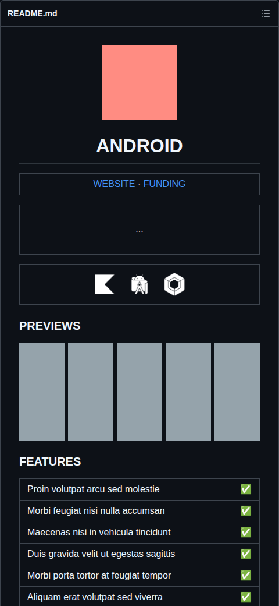
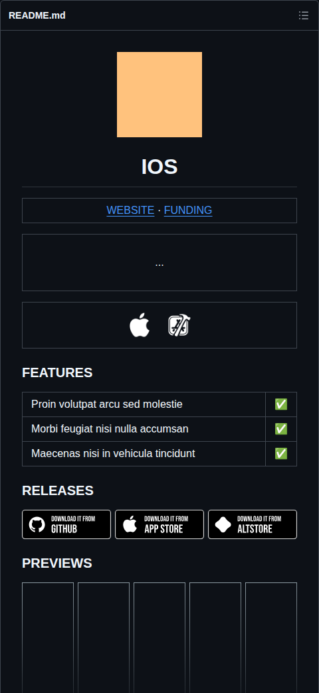
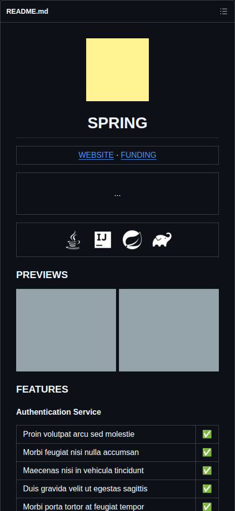
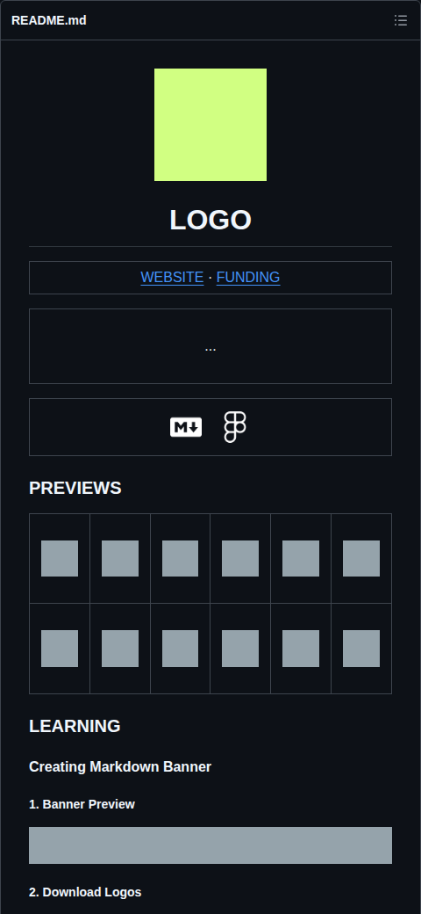
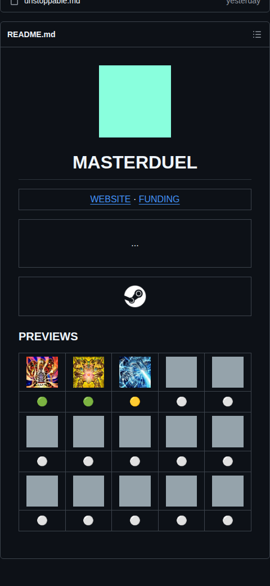
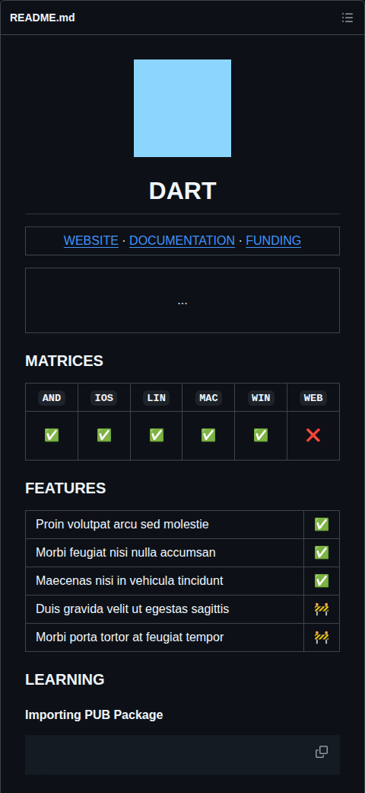
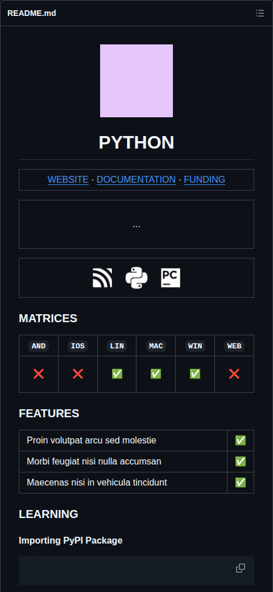
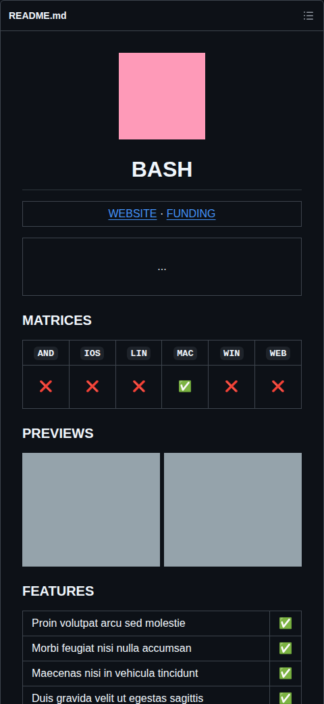
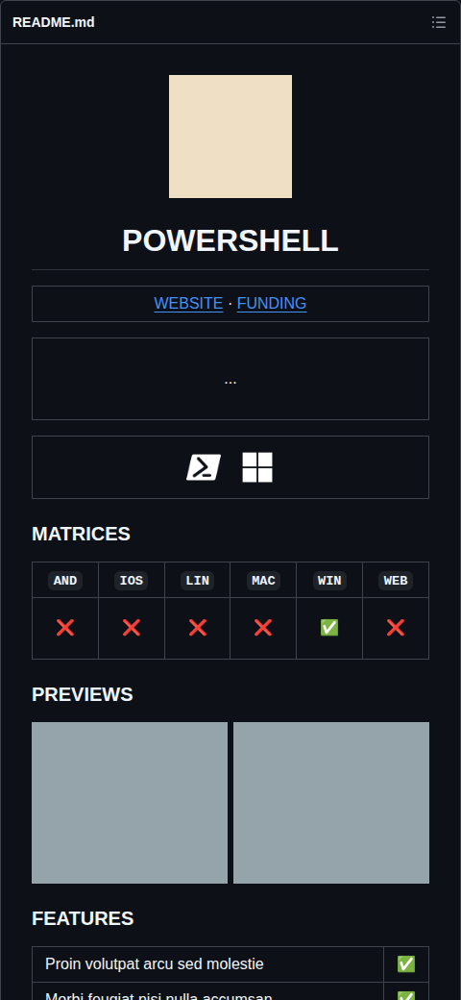

  

  <h1>READBASE</h1>

<table><tr><td align="center" width="9999">

  <a href="https://olankens.com">WEBSITE</a> ·
  <a href="https://ko-fi.com/olankens">FUNDING</a>

</td></tr></table>

<table><tr><td align="center" width="9999">&nbsp;

  README preset collection optimized for the vast majority of very commonly used Markdown renderers, including all those from GitHub, GitLab, PyPI, NPM, Crates, and many other similar very popular systems.

&nbsp;</td></tr></table>

<table align="center"><tr><td align="center" width="9999">

  <!-- LOGOS_START -->
  <picture><source media="(prefers-color-scheme: dark)" srcset="assets/logos/github-dark.png"></picture>
  <picture><source media="(prefers-color-scheme: dark)" srcset="assets/logos/kafka-dark.png"></picture>
  <picture><source media="(prefers-color-scheme: dark)" srcset="assets/logos/bash-dark.png"></picture>
  <picture><source media="(prefers-color-scheme: dark)" srcset="assets/logos/jetpackcompose-dark.png"></picture>
  <!-- LOGOS_CEASE -->

</td></tr></table>

### PREVIEWS

<!-- PRESETS_START -->

<a href="presets/app-android"><picture><source media="(prefers-color-scheme: dark)" srcset="assets/presets/app-android-light.png"></picture></a><picture></picture><a href="presets/app-ios"><picture><source media="(prefers-color-scheme: dark)" srcset="assets/presets/app-ios-light.png"></picture></a><picture></picture><a href="presets/backend-spring"><picture><source media="(prefers-color-scheme: dark)" srcset="assets/presets/backend-spring-light.png"></picture></a><picture></picture><a href="presets/bundle-logo"><picture><source media="(prefers-color-scheme: dark)" srcset="assets/presets/bundle-logo-light.png"></picture></a><picture></picture><a href="presets/bundle-masterduel"><picture><source media="(prefers-color-scheme: dark)" srcset="assets/presets/bundle-masterduel-light.png"></picture></a>

<a href="presets/library-dart"><picture><source media="(prefers-color-scheme: dark)" srcset="assets/presets/library-dart-light.png"></picture></a><picture></picture><a href="presets/library-python"><picture><source media="(prefers-color-scheme: dark)" srcset="assets/presets/library-python-light.png"></picture></a><picture></picture><a href="presets/script-bash"><picture><source media="(prefers-color-scheme: dark)" srcset="assets/presets/script-bash-light.png"></picture></a><picture></picture><a href="presets/script-powershell"><picture><source media="(prefers-color-scheme: dark)" srcset="assets/presets/script-powershell-light.png"></picture></a>

<!-- PRESETS_CEASE -->
