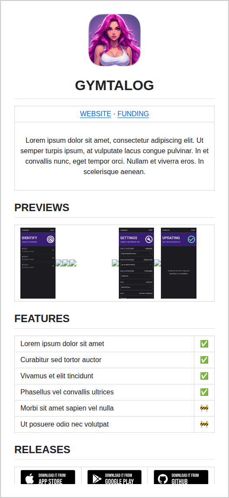
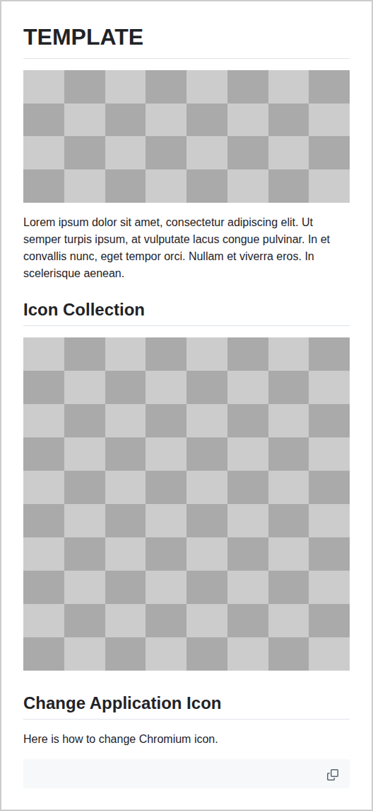
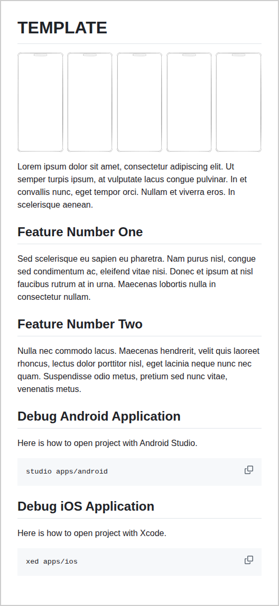
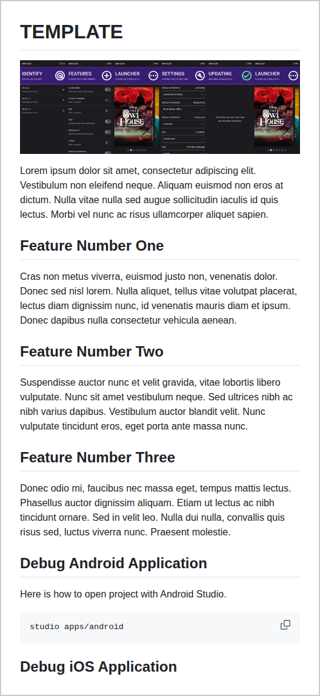
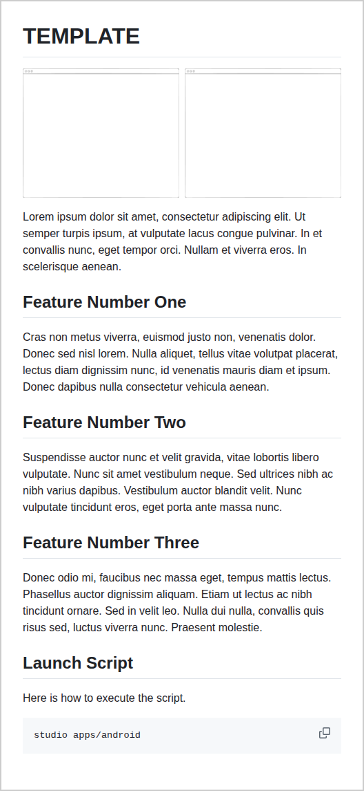
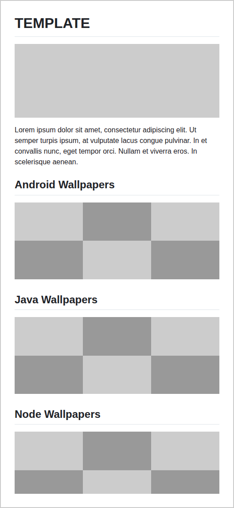
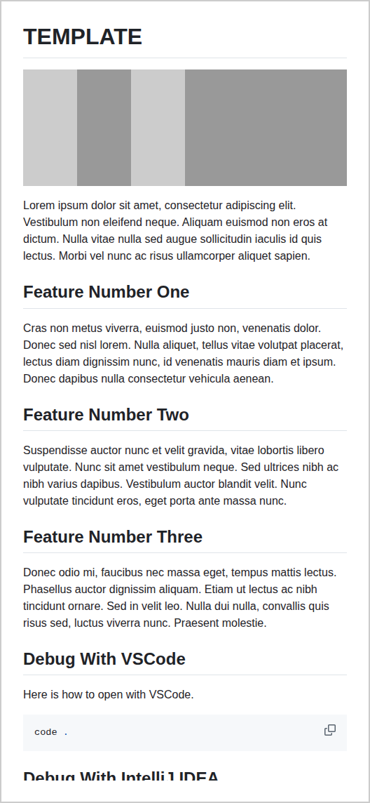

<div align="center">
  <p></p>
  <h1>READBASE</h1>
</div>

<table>
  <tbody><tr><td align="center" width="99999"><div>
    <a href="https://olankens.com">WEBSITE</a> ·
    <a href="https://ko-fi.com/olankens">FUNDING</a>
  </div></td></tr></tbody>
  <tbody><tr><td align="center" width="99999">&nbsp;<div>
    README Markdown templates tailored for maximum compatibility across many software registries like Crates, NPM, Pub, PyPi, and also the Git platforms like Codeberg, Gitee, GitHub, GitLab, and many more.
  </div>&nbsp;</td></tr></tbody>
</table>

## PREVIEWS

<table><tbody><tr><td width="99999">
  <picture></picture><picture></picture><picture></picture><picture></picture>
</td></tr></tbody></table>

## FEATURES

<!-- START_BLOCK -->
<table>
  <tbody><tr><td><a href="source/gymtalog"></a></td><td><a href="source/icons"></a></td><td><a href="source/mobile"></a></td><td><a href="source/shihogen"></a></td><td><a href="source/terminal"></a></td></tr></tbody>
  <tbody><tr><td><a href="source/wallpapers"></a></td><td><a href="source/website"></a></td></tr></tbody>
</table>
<!-- CEASE_BLOCK -->

## LEARNING

### CREATE NEW PRESET

```sh
cp -r source/readbase source/<preset>
```