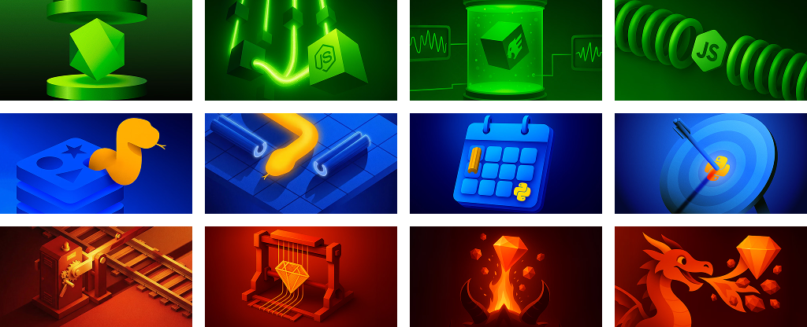

# DEVPAPER

<p></p>

Lorem ipsum dolor sit amet, consectetur adipiscing elit. Ut semper turpis ipsum, at vulputate lacus congue pulvinar. In et convallis nunc, eget tempor orci. Nullam et viverra eros. In scelerisque aenean.

## Node Wallpapers

<p></p>

## Python Wallpapers

<p></p>

## Ruby Wallpapers

<p></p>

## Change Gnome Wallpaper

```sh
​
​
​
​
```

## Change macOS Wallpaper

```sh
​
​
​
​
```

## Change Plasma Wallpaper

```sh
​
​
​
​
```

## Change Windows Wallpaper

```sh
​
​
​
​
```
