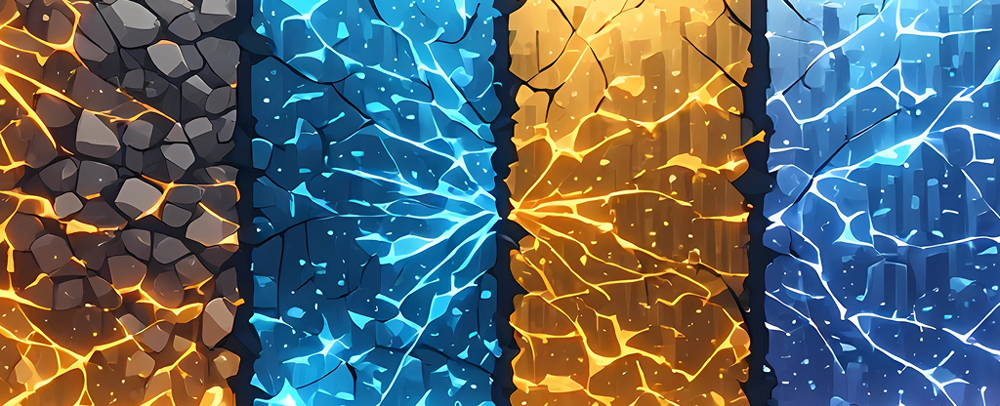

# SENCHARD

<p></p>

Lorem ipsum dolor sit amet, consectetur adipiscing elit. Ut semper turpis ipsum, at vulputate lacus congue pulvinar. In et convallis nunc, eget tempor orci. Nullam et viverra eros. In scelerisque aenean.

## Add Package

```sh
flutter pub add senchard --git-url https://github.com/olankens/senchard
```

## Create Client

```dart
var client = Client('television_ip_address_here', foolish: true);
```

## Update Picture Mode

```dart
await client
  ..attach()
  ..changePictureMode(PictureMode.cinemaNight)
  ..revertPictureMode()
  ..changeApplyPicture(ApplyPicture.all)
  ..changeLocalDimming(LocalDimming.off)
  ..changeBacklight(40)
  ..changeBrightness(50)
  ..changeContrast(70)
  ..changeColorSaturation(50)
  ..changeSharpness(5)
  ..changeAdaptiveContrast(AdaptiveContrast.off)
  ..changeUltraSmoothMotion(UltraSmoothMotion.off)
  ..changeNoiseReduction(NoiseReduction.off)
  ..changeColorTemperature(ColorTemperature.warm1)
  ..changeColorGamut(ColorGamut.native)
  ..changeGammaAdjustment(GammaAdjustment.gamma22)
  ..toggleViewingAngle()
  ..detach();
```