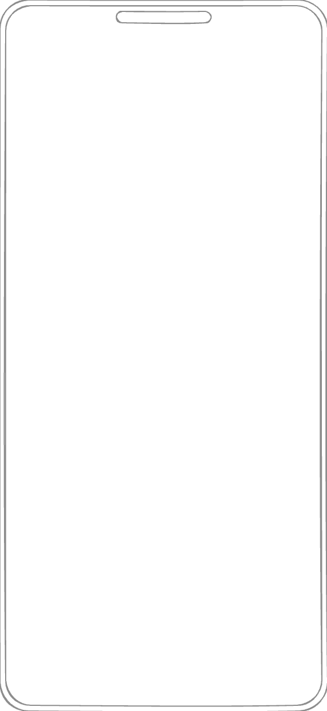

# TEMPLATE

<p>
<picture></picture><picture></picture><picture></picture><picture></picture>
</p>

Lorem ipsum dolor sit amet, consectetur adipiscing elit. Ut semper turpis ipsum, at vulputate lacus congue pulvinar. In et convallis nunc, eget tempor orci. Nullam et viverra eros. In scelerisque aenean.

## Feature Number One

Cras non metus viverra, euismod justo non, venenatis dolor. Donec sed nisl lorem. Nulla aliquet, tellus vitae volutpat placerat, lectus diam dignissim nunc, id venenatis mauris diam et ipsum. Donec dapibus nulla consectetur vehicula aenean.

## Feature Number Two

Suspendisse auctor nunc et velit gravida, vitae lobortis libero vulputate. Nunc sit amet vestibulum neque. Sed ultrices nibh ac nibh varius dapibus. Vestibulum auctor blandit velit. Nunc vulputate tincidunt eros, eget porta ante massa nunc.

## Feature Number Three

Donec odio mi, faucibus nec massa eget, tempus mattis lectus. Phasellus auctor dignissim aliquam. Etiam ut lectus ac nibh tincidunt ornare. Sed in velit leo. Nulla dui nulla, convallis quis risus sed, luctus viverra nunc. Praesent molestie.

## Debug Android Application

Here is how to open project with Android Studio.

```sh
studio apps/android
```

## Debug iOS Application

Here is how to open project with Xcode.

```sh
xed apps/ios
```