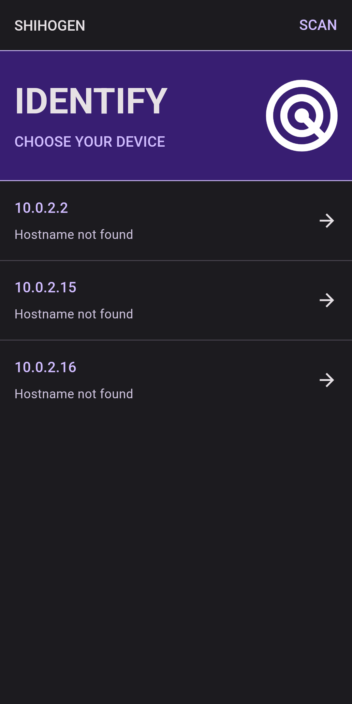
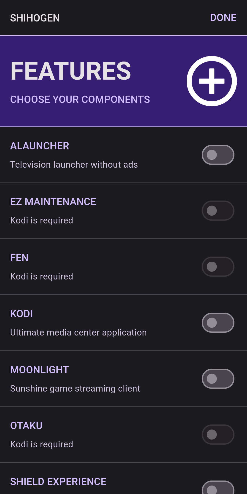
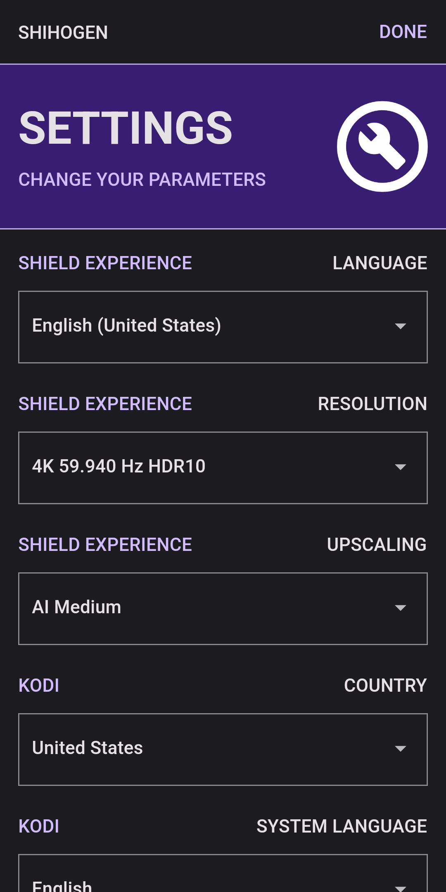
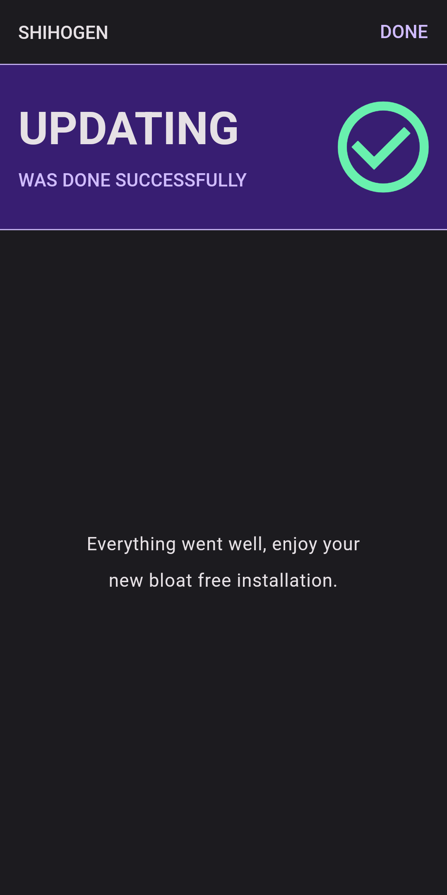

# SHINOMAN

<p><picture></picture><picture></picture><picture></picture><picture></picture></p>

Lorem ipsum dolor sit amet, consectetur adipiscing elit. Ut semper turpis ipsum, at vulputate lacus congue pulvinar. In et convallis nunc, eget tempor orci. Nullam et viverra eros. In scelerisque aenean.

## Download Latest Release

<p><a href="#"></a><picture></picture><a href="#"></a><picture></picture><a href="#"></a></p>

## Debug Android Application

```sh
studio apps/android
```

## Debug iOS Application

```sh
xed apps/ios
```